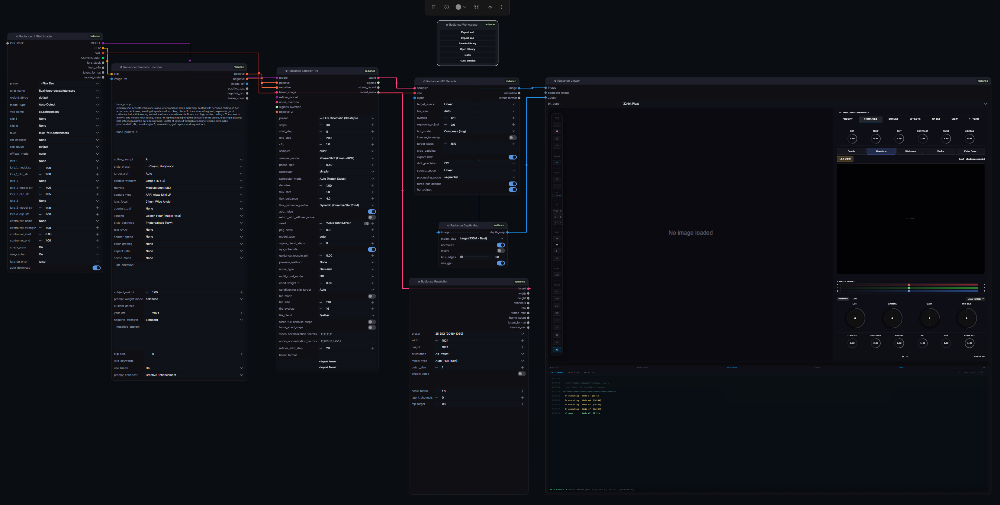
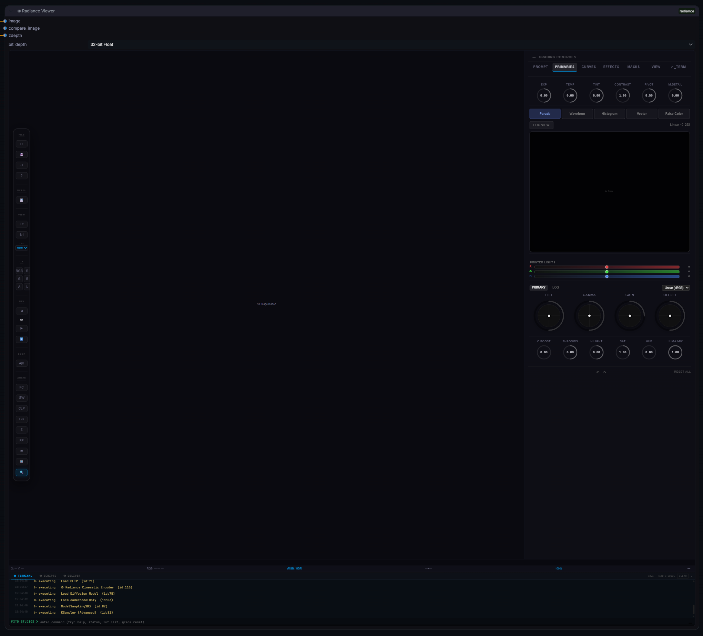

<div align="center">


◎ Radiance v2.2.1 — Professional VFX & HDR Suite for ComfyUI

[](https://github.com/fxtdstudios/radiance)
[](LICENSE)
[](https://github.com/fxtdstudios/radiance#node-reference)
[](https://registry.comfy.org/nodes/radiance)

**Radiance** is a professional, VFX-grade 32-bit float color science suite for ComfyUI. Built for film colorists and VFX artists who require absolute precision in their AI-assisted workflows.

[Installation](#installation) · [Node Reference](#node-reference) · [Quick Start](#quick-start) · [Viewer Shortcuts](#viewer-shortcuts) · [Documentation](https://radiance.fxtd.org) · [Support](https://github.com/fxtdstudios/radiance/issues)

</div>

---

## ◎ What's New - v2.2.1

> [!IMPORTANT]
> **Native 32-Bit Scene-Linear Engine**  
> Unlike standard ComfyUI nodes that clamp to 8-bit, Radiance preserves full IEEE 754 floating-point precision across the entire chain. Zero banding. Zero data loss.

- **Smart Overwrite Protection** — `Radiance Write` and `EXR Save` now feature automated index detection to prevent accidental file destruction.
- **Universal Digital Cinema I/O** — Consolidated Video, Image Sequence, and Single Image handling into a high-performance unified pipeline.
- **Robust Pipeline Validation** — Enhanced null-safety and input checking for high-load production environments.
- **Terminal HUD & Live REPL** — Nuke-style Python interaction directly inside the viewer for real-time data inspection.
- **Interactive Mask Editor** — Non-destructive brush masking in `◎ Radiance Load Image`.
- **◎ Radiance Grade Match** — Shot-to-shot color statistics transfer using CIE L\*a\*b\* mean/std math.

---

## <a name="node-reference"></a>◎ Node Reference (78 Professional Nodes)

The suite is organized into **11 specialized production zones** to mirror industry-standard VFX software topology.

<details>
<summary><b>◎ Project, Metadata & DNA (8 Nodes)</b></summary>

| Node | Description |
| :--- | :--- |
| **Radiance Workspace** | Local Project, Shot & Version management with secure .rad v2 containers |
| **Radiance Manager** | Cinematic Prompt Studio with 30+ Camera/Lens profiles |
| **Radiance DNA Reader/Writer** | Extraction and injection of cinematic metadata |
| **Radiance DNA Validator** | SHA256 integrity and version checking for workflow files |
| **Radiance Metadata Overlay** | Custom burned-in metadata (Project, Shot, Resolution) |

</details>

<details>
<summary><b>◎ Production I/O & Loaders (10 Nodes)</b></summary>

| Node | Description |
| :--- | :--- |
| **Radiance Read / Write** | Universal 32-bit I/O with auto-increment and high-bitrate support (H.265 10-bit, ProRes) |
| **Radiance Unified Loader** | Smart model loader (Flux/SDXL) with precision auto-detection |
| **Radiance LoRA Stack** | Multi-layer LoRA management in a single node |
| **Radiance CLIP Slot** | Specialized CLIP conditioning slots for multi-prompt chains |
| **Radiance Image & Mask** | Professional loader with non-destructive mask layering |

</details>

<details>
<summary><b>◎ HDR Imaging & Color Science (23 Nodes)</b></summary>

| Node | Description |
| :--- | :--- |
| **OCIO Color Transform** | Industry-standard OpenColorIO v2.2 integration |
| **ACES 2.0 Output** | Professional ACES 2.0 Display/View transforms |
| **Log Curve Decode/Encode** | Precise curves for LogC3/C4, S-Log3, REDLog, etc. |
| **HDR Tone Map / Expand** | Advanced dynamic range recovery and tonemapping |
| **Radiance VAE Encode/Decode** | 16-bit precision VAE processing for high-fidelity latents |
| **Radiance LUT Apply/Blend** | GPU-accelerated 33³ LUT processing with smooth blending |
| **Wide Gamut Utilities** | DaVinci and ARRI Wide Gamut color space primitives |

</details>

<details>
<summary><b>◎ VFX Grading & Analysis (15 Nodes)</b></summary>

| Node | Description |
| :--- | :--- |
| **Radiance Grade** | 32-bit Lift/Gamma/Gain/Offset with cinematic presets |
| **Radiance Grade Match** | CIE L\*a\*b\* mean/std statistics transfer for shot matching |
| **Apply Grade Info** | Replay saved grade JSON strings onto new shots with strength control |
| **Radiance Waveform** | GPU-accelerated RGB Parade / Luma / Overlay |
| **Radiance Vectorscope** | Phase-accurate hue/sat monitoring with Skin Tone line |
| **Radiance False Color** | IRE-calibrated 7-zone exposure mapping |
| **Radiance QC Pro** | Automated technical QC (Gamut, Clip, Banding) |

</details>

<details>
<summary><b>◎ AI Vision & Temporal (15 Nodes)</b></summary>

| Node | Description |
| :--- | :--- |
| **Radiance Sampler Pro** | High-end sampling (Flux/WAN) with AYS and Dynamic Guidance |
| **Radiance Resolution** | Advanced resolution selection with 8-pixel alignment |
| **Depth Anything V2** | Professional monocular depth estimation |
| **Radiance Temporal Smooth**| Motion-aware EMA flicker reduction for AI video |
| **Radiance Pro Upscale** | Vectorized kernel upscaling (Lanczos/Mitchell/Catmull-Rom) |

</details>

---

## <a name="quick-start"></a>◎ Quick Start Workflows



---

## <a name="installation"></a>◎ Installation

### Option 1: ComfyUI Manager
1. Open **ComfyUI Manager**
2. Search for **Radiance**
3. Click **Install**

### Option 2: Manual (Git)
```bash
cd ComfyUI/custom_nodes
git clone https://github.com/fxtdstudios/radiance.git
cd radiance
pip install -r requirements_windows.txt  # Or linux/mac_silicon
```

> [!TIP]
> **Linux/macOS Users**: Ensure you have `libopenexr-dev` installed via your package manager before running the requirements install.

---

## <a name="viewer-shortcuts"></a>◎ Professional Keyboard Shortcuts



Radiance is designed for a keyboard-driven VFX workflow. Use these shortcuts to monitor, grade, and navigate your shots with industry-standard precision.

### ◎ Navigation & Playback
| Key | Action |
| :--- | :--- |
| **Space** | Toggle Playback |
| **← / →** | Previous / Next Frame |
| **F** | Fit to View |
| **1** | 1:1 Pixel Zoom |
| **Shift + Drag** | Pan Image |
| **Esc** | Exit Fullscreen / Close Panels |

### ◎ Channel Monitoring
| Key | Action |
| :--- | :--- |
| **C** | RGB (Color) View |
| **R** | Red Channel |
| **G** | Green Channel |
| **B** | Blue Channel |
| **L** | Luma Channel |
| **Shift + A** | Alpha Channel |

### ◎ Analysis & Scopes
| Key | Action |
| :--- | :--- |
| **W** | Toggle Waveform (HDR-Aware) |
| **M** | Toggle Waveform Parade Mode |
| **V** | Toggle Vectorscope (w/ Skin Tone Line) |
| **S** | Cycle Safe Area Overlays |
| **Shift + G** | Cycle Grid Modes |
| **A** | Cycle A\|B Compare Modes |

## ◎ Community & Support

Radiance is backed by a professional team of VFX Technical Directors. Engage with us through our official channels:

### ◎ Official Discord Server
Join over 2,000+ artists and developers in the **FXTD Studios Discord**.
- **Production Workflows:** Access exclusive `.rad` templates and cinema-grade JSON presets.
- **Direct Engineer Support:** Real-time troubleshooting and feature requests.
- **Showcase:** share your work and get feedback from industry veterans.
- **Beta Access:** Test experimental HDR and temporal nodes before public release.

[**Join the FXTD Studios Discord**](https://discord.gg/WU3xUQXgp)

---

### ◎ Technical Resources
- **Documentation:** [radiance.fxtd.org](https://radiance.fxtd.org)
- **Issue Tracker:** [GitHub Issues](https://github.com/fxtdstudios/radiance/issues)
- **Official Site:** [fxtd.org](https://fxtd.org)

---

## ◎ License & Credits

- **License:** GPL-3.0
- **Authors:** Created by the FXTD Studios team.
- **Technology:** Built on **OpenColorIO v2.2**, **OpenEXR**, and **Colour-Science**.
- **Special Thanks:** The ComfyUI community for pushing the boundaries of AI generation.

---
[↑ Back to top](#radiance)
