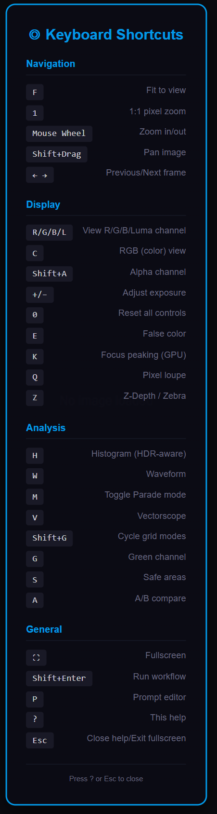

<div align="center">
<br>


# ◎ Radiance

Professional VFX, HDR color science, review, and DCC handoff nodes for ComfyUI.

[](https://github.com/fxtdstudios/radiance)
[](LICENSE)
[](#node-map)
[](https://registry.comfy.org/nodes/radiance)

**Radiance** is a production-oriented ComfyUI node pack for 32-bit image pipelines, HDR/ACES color management, VFX plate prep, video workflows, review tools, in-canvas studio dashboards, and Nuke/Resolve studio handoff.

[Install](#install) · [Documentation](docs/index.html) · [Node Map](#node-map) · [Studio Dashboards](#studio-dashboards) · [DCC Handoff](#dcc-handoff) · [Release Status](#release-status) · [Support](#support)

</div>

---

## Highlights

- 32-bit float image and EXR workflows for VFX and finishing, with lossless scene-linear round-trips.
- ACES, OCIO, log curves, LUTs, CDL, scopes, QC, and grade-transfer tools.
- VFX utilities for plate prep, masks, roto, depth, camera/optics, motion, multipass, **real AOV ingestion**, and relighting.
- Video and temporal workflow nodes for loading, routing, conditioning, sampling, and delivery.
- **In-canvas Studio Dashboards** — Project Manager, Workflow Library, and an Assets manager, rendered over the ComfyUI canvas (no new browser tab).
- **Smart Sampler Pro** — preset-driven UI that hides irrelevant parameters and folds dynamically per model.
- **Radiance Pro Viewer** and a lightweight **Lite Viewer** with scopes, frame review, and shortcuts.
- **HDR VAE decoders** (Turbo + Full) and **HDR LoRA** tooling for scene-linear generation.
- **Dynamic Gizmos** — collapse any node subgraph into a styled, reusable custom node.
- DCC handoff for Nuke and DaVinci Resolve, with secure-by-default bridge behavior.

## Studio Dashboards

Radiance ships three production dashboards that open **in-canvas** (a modal overlay over the ComfyUI graph, not a browser tab) from the **◎ Radiance Project Manager** node. All three share a dark, FXTD-themed minimal UI.

| Dashboard | Purpose |
| :--- | :--- |
| **Project Manager** | Show / sequence / shot view with a status pipeline (WIP · Review · Approved · Retake), version history, a click-through shot drawer, project storage, and recent outputs — backed by a live API over your saved `.rad` workflows. |
| **Workflow Library** | Browse, search, preview, and load saved `.rad` workflows back into the canvas, organized by production bins. |
| **Assets** | Media manager that scans the ComfyUI input/output folders and classifies images, videos, and image **sequences** (auto-grouped by frame range). Create custom bins, filter by type, search, drag-drop import, and inspect each asset in a detail drawer. |

The Project Manager node groups its launchers (Open / Save / external links) into a compact widget on the node body.

## Smart UI

- **Dynamic Sampler Pro.** `◎ Radiance Sampler Pro` hides all parameters when the preset is `None`, shows everything in `Custom`, and for a named preset shows only the parameters relevant to that model — Flux-only controls fold away on non-Flux presets, and tile / restart / refiner / sigma-blend params appear only when active.
- **In-canvas overlays.** Dashboards render over the graph and close with Esc, the dimmed backdrop, or the ✕ — with an "Open in tab" escape hatch.
- **Dynamic Gizmos.** Collapse any selection of nodes into a single styled custom node (subgraph harness), saved to the `gizmos/` folder and re-loaded as a first-class node.
- **Smart Backdrops.** Group nodes get a tinted-glass fill keyed to the node category instead of a near-invisible background.

## Documentation

The documentation website starts at [docs/index.html](docs/index.html), with source Markdown in [docs/index.md](docs/index.md). It includes quickstart setup, production concepts, workflow recipes (rendered as diagrams), a full node reference, troubleshooting, developer notes, and a coverage ledger for the registered node catalog.

## Install

### ComfyUI Manager / Comfy Registry

Search for **Radiance** in ComfyUI Manager or install from the Comfy Registry when published.

### Manual Git Install

```bash
cd ComfyUI/custom_nodes
git clone https://github.com/fxtdstudios/radiance.git
cd radiance
pip install -r requirements.txt
```

Windows users can use `requirements_windows.txt`; Apple Silicon users can use `requirements_mac_silicon.txt`.

> Radiance assumes ComfyUI already provides `torch`. Install Radiance inside the same Python environment used by ComfyUI.

## Feature Spotlights

### Viewers

- **Radiance Pro Viewer** — full review surface with waveform/vectorscope, channel isolation, A/B compare, focus peaking, frame stepping, and keyboard shortcuts (see [Viewer Shortcuts](#viewer-shortcuts)).
- **Radiance Lite Viewer** — a lightweight inline viewer for quick frame inspection without the full review chrome.

### HDR VAE Decoders

- **Turbo Decoder** (`RadianceTurboDecoder`) — lightweight, near-realtime latent → scene-linear decode for fast iteration via `decode_to_linear_realtime`.
- **Full Decoder** (`RadianceFullDecoder`) — deep residual decoder for production-quality reconstruction.
- Exposed through **◎ Radiance HDR VAE Decode**, which also emits a decode-settings metadata string.

### HDR LoRA

- **HDR LoRA Loader / Apply** (`RadianceHDRLoRALoader`, `RadianceHDRLoRAApply`) — load and apply LoRAs tuned for HDR / scene-linear generation.
- **LoRA Stack** (`RadianceLoraStack`) — stack multiple LoRAs with per-LoRA model/clip strengths.

### Dynamic Gizmos

Select any subgraph in ComfyUI and collapse it into a single styled **Gizmo** node — a reusable, shareable custom node saved under `gizmos/` and registered dynamically at load.

## Node Map

Radiance is organized under:

```text
FXTD STUDIOS/Radiance
├─ Core
├─ Load & Save
├─ Generate
├─ Color
├─ HDR
├─ VFX
├─ Video
├─ Upscale
├─ Review
├─ Pipeline
└─ Developer
```

The source exposes **104 registered node classes** (plus runtime-generated Gizmos). Runtime availability depends on installed optional dependencies and ComfyUI environment support.

### Core Groups

| Group | Examples |
| :--- | :--- |
| Core | Radiance Project Manager / Workspace, Resolution, workspace utilities |
| Load & Save | Radiance Read, Radiance Write (EXR alpha/mask), image/mask loading, EXR multipart and sequence export |
| Generate | Unified Loader, Sampler Pro, HDR VAE Decode, prompt tools, LoRA stack, HDR LoRA, regional prompts |
| Color | Grade, Grade Match, CDL, LUTs, Curves, Hue Curves, White Balance, Color Space Convert |
| HDR | ACES 2.0, OCIO, HDR VAE encode/decode, tone mapping, HDR synthesis, relight, QC |
| VFX | Plate prep, masks, roto, SAM, depth, optics, motion, multipass, AOV reader (real EXR layers), relight |
| Video | Video loader, prompt builder, sampler, T2V/I2V, routing, batch decode, export |
| Upscale | Image/video upscale (HDR + color aware), tiling, face restoration |
| Review | Radiance Pro Viewer, Lite Viewer, scopes, focus peaking, contact sheets, flipbook, preview server, policy guard |
| Pipeline | Project Manager, MCP Bridge, Nuke Send, DaVinci Resolve folder handoff |

## DCC Handoff

### Nuke

Radiance can export EXR frames and push them to a running Nuke session through the Radiance TCP listener.

Inside Nuke, run:

```python
exec(open("/path/to/ComfyUI/custom_nodes/radiance/scripts/start_nuke_server.py").read())
```

Then use **◎ Radiance Send to Nuke** or **◎ Radiance MCP Bridge** from ComfyUI.

Security defaults:

- Listener binds to `127.0.0.1` by default.
- Structured actions are enabled for normal production operations.
- Raw dynamic Python execution is disabled unless `RADIANCE_DEV=1`.
- Optional token auth uses `RADIANCE_DCC_AUTH_TOKEN`.

### DaVinci Resolve

Radiance currently supports Resolve as a **folder handoff / manual import** workflow through **◎ Radiance Send to DaVinci Resolve**. It exports PNG, TIFF, or EXR media into a Resolve-accessible folder.

The experimental `scripts/resolve_bridge.py` helper must be run inside DaVinci Resolve Studio when using Resolve scripting APIs.

## Release Status

| Area | Status |
| :--- | :--- |
| GitHub source layout | Ready |
| Comfy Registry metadata | Ready after publisher/token setup |
| Runtime dependency list | Ready |
| `.comfyignore` package cleanup | Ready |
| Node branding/menu taxonomy | Ready |
| Nuke bridge smoke test | Passed |
| MCP bridge smoke test | Passed |
| DaVinci Resolve live API push | Not included; folder handoff only |
| Full pytest suite (real torch + OpenEXR) | Passed — 1366 passed, 34 skipped |
| HDR/EXR I/O regression tests | Passed (scene-linear preserved; alpha round-trips; no 0-byte writes) |
| Full ComfyUI import test | Run in the target ComfyUI environment before tagging |

## Known Limitations (v3.1.1)

- **RUDRA dynamic-range conditioning not included.** The Turbo and Full HDR VAE decoders ship and work; the dynamic-range-conditioned (`dr_dim`) RUDRA variant is not part of this release and the related toggle falls back to baseline decoding.
- **Estimated VFX passes are estimates.** The Multipass *Master* extractor derives passes (albedo, roughness, AO, segmentation ID, etc.) from a single beauty image — useful for AI/2D footage, but not physically-accurate render AOVs. For ground-truth passes, feed a multilayer EXR through the **Multipass: AOV Reader**. The segmentation ID output is a clustered matte, not a spec-compliant Cryptomatte.
- **Legacy import shims.** Root `nodes_*.py` modules remain as deprecation shims for backward-compatible imports; they register no nodes and will be removed in a future release.
- **SR upscale color.** Super-resolution backends are display-referred; for scene-linear input use the upscaler's `hdr_mode` (Reinhard preserve) and `color_encoding` (OETF round-trip) options.
- **In-canvas DOM widgets.** The grouped node launcher and dashboard overlays rely on ComfyUI DOM widgets; the launcher falls back to native buttons on builds that do not render them.

## Publish Checklist

1. Confirm `pyproject.toml` has the final version.
2. Confirm your Comfy Registry publisher id is `fxtdstudios`.
3. Add the GitHub secret `REGISTRY_ACCESS_TOKEN`.
4. Run the lightweight local release check:

```bash
python tools/check_release_ready.py
```

5. Run CI on GitHub.
6. Tag the release:

```bash
git tag v3.1.1
git push origin v3.1.1
```

The publish workflow will publish to Comfy Registry and create a GitHub Release after the publish gate passes.

## Viewer Shortcuts




| Key | Action |
| :--- | :--- |
| Space | Toggle playback |
| Left / Right | Previous / next frame |
| F | Fit to view |
| 1 | 1:1 pixel zoom |
| C / R / G / B / L | Color, red, green, blue, luma channels |
| W | Toggle waveform |
| V | Toggle vectorscope |
| A | Cycle A/B compare modes |

## Support

- Issues: [GitHub Issues](https://github.com/fxtdstudios/radiance/issues)
- Documentation: [radiance.fxtd.org](https://radiance.fxtd.org)
- Studio: [fxtd.org](https://fxtd.org)

## License

Radiance is released under the [GPL-3.0 license](LICENSE).
