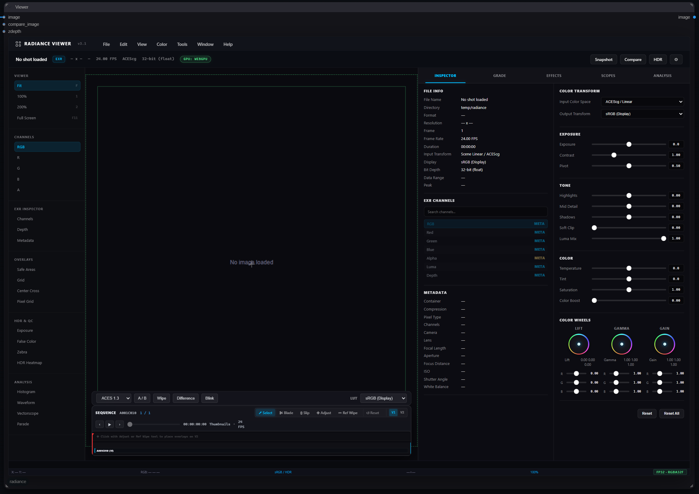
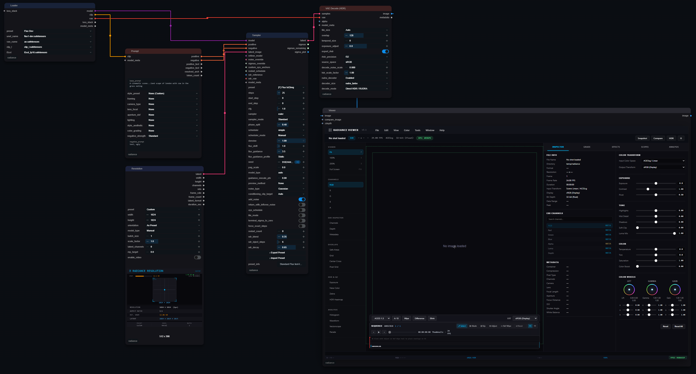

<div align="center">
<br>


**Professional VFX, HDR color science, review, and DCC handoff for ComfyUI.**

[](https://github.com/fxtdstudios/radiance)
[](LICENSE)
[](#node-map)
[](https://registry.comfy.org/nodes/radiance)
[](https://huggingface.co/fxtdstudios/RUDRA)

Radiance is a production-grade node pack for ComfyUI built around 32-bit float and HDR/ACES image pipelines. It brings VFX plate prep, color management, review tooling, in-canvas studio dashboards, and Nuke / DaVinci Resolve handoff into one coherent toolkit, so you can take a shot from generation through finishing without leaving the graph.

Artists get 32-bit, HDR, and ACES image tools, professional viewers, and VFX nodes. Supervisors and coordinators get project, shot, asset, and workflow management built directly into the canvas.

[Install](#installation) · [What it does](#what-it-does) · [Node map](#node-map) · [DCC Handoff](#dcc-handoff) · [Known limitations](#known-limitations) · [Status](#status) · [Documentation](#documentation) · [Support](#support)

</div>

---

## Overview

- 32-bit float and EXR workflows for VFX and finishing, with lossless scene-linear round-trips.
- ACES, OCIO, log curves, LUTs, CDL, scopes, QC, and grade-transfer tools.
- VFX utilities for plate prep, masks, roto, depth, camera and optics, motion, multipass, real AOV ingestion, and relighting.
- Video and temporal workflow nodes for loading, routing, conditioning, sampling, and delivery.
- In-canvas studio dashboards — Project Manager, Workflow Library, and Assets — rendered over the ComfyUI graph, never in a separate browser tab.
- **Radiance Sampler** — a preset-driven sampler that hides irrelevant parameters and adapts to the selected model.
- A full-featured **Viewer** and a lightweight **Lite Viewer** with scopes, frame review, and keyboard shortcuts.
- HDR VAE decoders (Turbo and Full) and HDR LoRA tooling for scene-linear generation.
- Dynamic Gizmos — collapse any group of nodes into a single reusable custom node.
- Secure-by-default handoff to Nuke and DaVinci Resolve.

## In action

**The Radiance Viewer** — WebGPU-accelerated review at FP32/RGBA32F end to end: EXR channel and layer inspection, OpenColorIO 2.5 — load a show's config and the Display and View menus come from it, applied through OCIO's own GPU path — with a built-in ACES 1.3 pipeline as the fallback, exposure/tone/colour controls with lift-gamma-gain wheels, scopes (histogram, waveform, vectorscope, parade) with selectable scales — 10-bit and 12-bit code value, percent, mV, and nits for ST.2084 and HLG — data or video levels, and a switch for whether they measure before or after the viewer colour transforms, a pixel probe with per-region min/max/mean/median and NaN/Inf reporting, false colour, zebra, a nit-accurate HDR heatmap anchored to BT.2408 reference white, safe areas labelled with the standard they come from (SMPTE ST 2046-1 / EBU R 95), aspect-ratio mattes, nearest-neighbour magnification on N, timecode, A/B compare with wipe, difference and blink, and a sequence timeline with per-frame thumbnails.

<div align="center">

</div>

**A generation-to-review graph** — Loader → Prompt → Resolution → Sampler → VAE Decode (HDR) in Direct HDR / RUDRA mode → Viewer. The decode stays scene-linear the whole way; the Viewer applies the display transform, so what you grade is what the file actually contains.

<div align="center">

</div>

## Installation

### ComfyUI Manager / Comfy Registry

Search for **Radiance** in ComfyUI Manager, or install it from the Comfy Registry.

### Requirements

Install into the **same Python environment as ComfyUI** — Radiance relies on ComfyUI's existing PyTorch. Dependencies are pure Python (no CUDA toolkit or compiler required). Use the requirements file that matches your platform, shown below.

### Windows

```bat
cd ComfyUI\custom_nodes
git clone https://github.com/fxtdstudios/radiance-beta.git

cd radiance
pip install -r requirements_windows.txt
```

### Ubuntu / Linux

Install the system libraries OpenCV needs (OpenEXR and OCIO ship as self-contained wheels):

```bash
sudo apt update
sudo apt install -y git python3-venv build-essential libgl1 libglib2.0-0 ffmpeg
```

> On Ubuntu 22.04 the package is `libgl1-mesa-glx`; on 24.04+ it's `libgl1`.

Then, inside ComfyUI's environment:

```bash
cd ComfyUI/custom_nodes
git clone https://github.com/fxtdstudios/radiance.git
cd radiance
pip install -r requirements_linux.txt
```

### WSL (Ubuntu on Windows)

WSL2 is Ubuntu with GPU passthrough, so follow the Ubuntu steps above (including `requirements_linux.txt`), plus:

- Install the NVIDIA driver on the **Windows host only** — never a Linux NVIDIA driver inside WSL. Verify with `nvidia-smi` inside WSL.
- No CUDA Toolkit needed — PyTorch's bundled CUDA runtime handles the GPU.
- Keep ComfyUI on the Linux filesystem (`~/ComfyUI`), not `/mnt/c/...`, for speed; open the UI from Windows at `http://localhost:8188`.

### macOS (Apple Silicon)

```bash
cd ComfyUI/custom_nodes
git clone https://github.com/fxtdstudios/radiance.git
cd radiance
pip install -r requirements_mac_silicon.txt
```

### Verify

Start ComfyUI and look for `Radiance: successfully loaded 131 nodes` in the log.
A lower count means a node module failed to import — usually a missing optional
dependency; the Environment Guard table printed at startup shows which.

For a full machine-level check (every node executed on your GPU, VRAM peaks,
RUDRA decoder benchmarks and scores), run:

```bat
cd ComfyUI
python custom_nodes\radiance\tools\gpu_acceptance.py
```

It writes `gpu_acceptance_report.md` next to the script, and names any nodes
missing on your install.

### Models (RUDRA decoders)

The HDR VAE decoders (Turbo and Full) use trained **RUDRA** decoder weights, published on Hugging Face under Apache-2.0: [fxtdstudios/RUDRA](https://huggingface.co/fxtdstudios/RUDRA/tree/main).

Download the `.safetensors` files and place them in your ComfyUI models folder under a `radiance` subfolder — create it if it doesn't exist:

```
ComfyUI/models/radiance/
```

Radiance finds the checkpoints there automatically by filename, so keep the original names (for example `rudra_turbo_decoder_flux_ema.safetensors`). Download only the decoders for the models you use:

| Model | Turbo | Full |
| :--- | :---: | :---: |
| Flux.1 | `rudra_turbo_decoder_flux_ema` | `rudra_full_decoder_flux_ema` |
| Flux.2 | `rudra_turbo_decoder_flux2_ema` | — |
| Flux.2 Klein | `rudra_turbo_decoder_flux2-klein_ema` | — |
| SDXL | `rudra_turbo_decoder_sdxl_ema` | `rudra_full_decoder_sdxl_ema` |
| Qwen-Image | `rudra_turbo_decoder_qwen_ema` | — |
| Z-Image | `rudra_turbo_decoder_zimage_ema` | `rudra_full_decoder_zimage_ema` |
| Wan | `rudra_turbo_decoder_wan_ema` | `rudra_full_decoder_wan_ema` |
| LTX-Video | `rudra_turbo_decoder_ltx_ema` | `rudra_full_decoder_ltx-video_ema` |

To fetch everything at once with the Hugging Face CLI:

```bash
pip install -U "huggingface_hub[cli]"
huggingface-cli download fxtdstudios/RUDRA --local-dir "ComfyUI/models/radiance"
```

### Example workflow

To get started quickly, drag [`workflows/start.json`](workflows/start.json) onto the ComfyUI canvas — a ready-made graph wiring the Radiance loader, Sampler Pro, HDR VAE decode, and viewers end to end.

## What it does

### Reading and writing

Read opens images, EXRs, video and numbered sequences from any absolute path, including UNC and mapped drives. It works out what a path is from the extension and the pattern, so `/renders/shot.%04d.exr`, `/frames/####.png` and a bare directory all resolve to a sequence. Open one frame of a sequence and it offers you the whole range.

Video decodes through a single raw ffmpeg pipe at the source's own bit depth. 10, 12 and 16-bit survive. ProRes 4444 alpha comes out on the mask output, frame ranges are exact rather than approximate, and the container's colour tags are read instead of assumed. The `info` output is a JSON wire carrying resolution, frame count and range, bit depth, codec, EXR layers and windows, colour tags and timecode — Nuke's metadata tab, as something you can plug into.

Write covers PNG 8 and 16-bit, JPEG, TIFF 16 and 32-float, DPX, WebP, Radiance HDR, EXR half and float, H.264, H.265 10-bit, ProRes 422 and 4444, DNxHR, and numbered sequences of any of the still formats. It shows you the path that will actually land on disk before you run it, assembled by the same code that does the writing. `overwrite` is off by default; an existing file gets a unique suffix rather than being replaced.

### Colour

Load a show's OCIO config and the Display and View menus come from it. Nothing is re-implemented: the transform is OCIO's own, applied through its generated GPU shader in the Viewer. With no config loaded, the built-in ACES 1.3 pipeline runs as before. OCIO is a capability here, not a dependency.

The grading nodes are the ones you would expect from a compositing package. Grade, Grade Match, CDL, Curves, Hue Curves, White Balance, LUT Apply and Blend, Colour Space Convert, and a QC pass. Sixteen colour spaces, including the camera logs — ARRI LogC3 and LogC4, Sony S-Log3, Panasonic V-Log, Canon Log 3, RED Log3G10, DaVinci Intermediate — plus PQ, HLG, ACEScg and ACEScct.

Both ACES 2.0 tone scales are implemented against the published Output Transform table.

### HDR

Log encoding happens before the VAE, not after it, and the Compress Log profiles are clamp-free from decode through to the file. Highlights above 1.0 reach disk. That is the claim the package is built on and there is a test that writes negatives and values up to 64.0 through EXR and TIFF and requires them back exactly.

The HDR VAE Decode node has two decoders. Turbo is light enough to iterate with. Full is slower and reconstructs more. Both report the settings they used. Weights are the RUDRA models; see the install section for where they go.

There is also HDR LoRA loading and application, a LoRA stack with per-LoRA model and CLIP strengths, tone mapping, HDR synthesis, and relighting.

### The Viewer

FP32 and RGBA32F end to end, on WebGL2.

Scopes: histogram, waveform, vectorscope and parade. You pick the scale — 10 or 12-bit code value, percent, millivolts, or nits for ST.2084 and HLG — and data or video levels, and whether the scopes measure before or after the viewer's colour transforms. Every graticule line carries its number.

The pixel probe samples a cursor, a region or the whole frame, and reports RGBA, luminance, EV, cd/m², HSV and hex, with min, max, mean and median per channel. NaN, Inf and negative counts are excluded from the statistics and reported separately, because a mean that quietly includes a NaN is worse than no mean.

Then the things you reach for while looking: false colour, zebra, a nit-accurate HDR heatmap anchored to BT.2408 reference white, safe areas labelled with the standard they come from, aspect-ratio mattes, nearest-neighbour magnification, timecode, A/B compare with wipe, difference and blink, EXR channel and layer inspection, focus peaking, and a sequence timeline with per-frame thumbnails.

A Lite Viewer exists for when you want a frame on the node and nothing else.

| Key | Action |
| :--- | :--- |
| Space | Play / pause |
| Left / Right | Previous / next frame |
| F | Fit to view |
| 1 | 1:1 pixels |
| C / R / G / B / L | Colour, red, green, blue, luma |
| W | Waveform |
| V | Vectorscope |
| A | Cycle A/B compare |
| N | Nearest-neighbour / linear |

### VFX

Plate prep, masks, roto, depth, optics, motion, and multipass. The Multipass Master extractor derives passes from a single image, which is useful for generated footage and is not a render pass; when you have real AOVs, the Multipass AOV Reader takes a multilayer EXR. Relighting works off either.

### Video

Loader, prompt builder, sampler, text-to-video, image-to-video, routing, batch decode and export. Upscaling is available for stills and for video, with HDR and colour-encoding options so scene-linear input survives a backend that works in display space.

### Studio dashboards

Three of them, opened from the Project Manager node. They render over the ComfyUI graph rather than in another tab, and close with Esc.

| Dashboard | What it holds |
| :--- | :--- |
| **Project Manager** | Shows, sequences and shots, with a WIP / Review / Approved / Retake pipeline, version history, a shot panel, project storage and recent outputs, read from your saved workflows. |
| **Workflow Library** | Search, preview and load saved workflows back into the canvas, organised into bins. |
| **Assets** | Scans the ComfyUI input and output folders, sorts images, video and sequences (grouped by frame range), and gives you bins, filters, search, drag-and-drop import and a detail panel. |

### Things that make the graph easier to live with

The Sampler shows nothing until you pick a preset, everything in Custom, and only the parameters that matter to the model you named. Read plays MP4, MOV and WebM on the node with scrubbing, and falls back to a first-frame poster for codecs the browser cannot decode. Group nodes get a tinted backdrop keyed to category instead of a near-invisible panel. And any selection of nodes can be collapsed into a Gizmo: one node, saved and reloaded like any other.

## Node map

Everything lives under one menu.

```text
FXTD STUDIOS/Radiance
├─ Core
├─ Load & Save
├─ Generate
├─ Color
├─ HDR
├─ VFX
├─ Video
├─ Upscale
├─ Review
└─ Pipeline
```

**131 nodes**, plus whatever Gizmos you build. A few depend on optional packages.

Compositing nodes use compositing names — `Grade`, `CDL`, `OCIO ColorSpace`, `Roto`, `Defocus`, `Viewer`, `Read`, `Write` — so they read the way they do in Nuke or Flame. The diffusion layer keeps a `Radiance` prefix, so `Radiance Sampler` and `Radiance VAE Decode` are obviously the AI ones. Typing "radiance" in the search still finds everything.

| Group | What's in it |
| :--- | :--- |
| Core | Project Manager, Workspace, Resolution, workspace utilities |
| Load & Save | Read, Write, EXR alpha and mask, EXR multipart, sequence export, DPX read and write |
| Generate | Loader, Sampler, VAE Decode (HDR), prompt tools, LoRA stack, HDR LoRA, regional prompts |
| Color | Grade, Grade Match, CDL, LUT Apply / Blend, Curves, Hue Curves, White Balance, Colour Space Convert, QC, Policy Guard |
| HDR | ACES 2.0, OCIO, HDR VAE encode and decode, tone mapping, HDR synthesis, relight, QC |
| VFX | Plate prep, masks, roto, depth, optics, motion, multipass, AOV reader, relight |
| Video | Loader, prompt builder, sampler, text-to-video, image-to-video, routing, batch decode, export |
| Upscale | Image and video upscale, tiling, face restoration |
| Review | Viewer, Lite Viewer, scopes, focus peaking, contact sheets, flipbook, preview server |
| Pipeline | Project Manager, Send to Nuke, DaVinci Resolve handoff |

## DCC Handoff

### Nuke

Radiance can export EXR frames and send them to a running Nuke session over a local connection.

Inside Nuke, run:

```python
exec(open("/path/to/ComfyUI/custom_nodes/radiance/scripts/start_nuke_server.py").read())
```

Then use the Send to Nuke node from ComfyUI. The listener binds to `127.0.0.1` by default and only accepts structured production actions.

### DaVinci Resolve

Radiance supports DaVinci Resolve through a folder handoff: the Send to DaVinci Resolve node exports PNG, TIFF, or EXR media into a folder Resolve can import.

## Notes & Tips

- **Estimated VFX passes.** The Multipass Master extractor derives passes (albedo, roughness, ambient occlusion, segmentation ID, and more) from a single image — handy for 2D and generated footage, but not a substitute for true render passes. For ground-truth passes, feed a multilayer EXR through the Multipass AOV Reader. The segmentation output is a clustered matte, not a Cryptomatte.
- **Super-resolution and color.** Upscale backends work in display-referred space. For scene-linear input, use the upscaler's HDR and color-encoding options to preserve your values.
- **Previews from a NAS or server path.** The Read node opens any absolute path (local, mapped drive, UNC), but its inline preview/info widgets are served over unauthenticated HTTP routes restricted to ComfyUI's own folders. To preview media elsewhere, allow those roots explicitly (`;`-separated on Windows) and restart ComfyUI:

  ```bat
  setx RADIANCE_READ_ROOTS "Z:\renders;\\server\share\plates"
  ```

- **Upgrading from ≤ 3.2.0: re-check graded masters.** `RadianceColorSpaceConvert` previously performed no conversion at all for 10 of its 16 spaces (all camera-log and ACES working spaces) whenever no OCIO config was loaded — the default install. Anything that passed through those conversions was graded on unconverted pixels. Details in the [changelog](CHANGELOG.md).

## Known limitations

Kept here rather than in a tracker, because a control that quietly does nothing
is worse than one that says so. Full detail in the [changelog](CHANGELOG.md).

- **The ACES 2.0 tone scale is not the Daniele Evo curve.** It is a log-space
  contrast of 1.55 with a tanh shoulder, so 18% grey sits about 0.84 stop above
  the ACES 2.0 reference on SDR, and HLG diffuse white lands at signal 0.915
  rather than 0.75. The normalisation defects around it were fixed in 3.2.0;
  the curve itself has not been replaced yet. Grade by eye against a reference,
  not by trusting the label.
- **`blend_mode = "laplacian_pyramid"`** falls back to the Gaussian feather.
  `"linear"` and `"gaussian_feather"` are genuinely different.
- **`chromatic_adaptation` has no effect.** The white-point adaptation is baked
  into the precomputed conversion matrices.
- **Optical flow is pyramidal Lucas–Kanade**, not DIS or a learned method, and
  it thins out above roughly 8 px of motion. What degrades is the *field*, not
  the estimate: the median displacement stays within a few percent out to about
  20 px, but the fraction of the field landing within half a pixel falls from
  100% at 3 px to 84% at 8, 71% at 12, 58% at 16 and 29% at 20. Mask
  propagation tears where the field is patchy, so treat ~8 px as the working
  limit rather than the point of failure.

  Making the pyramid deeper does not fix it, and this was measured rather than
  assumed. The ceiling is the integration window — the coarsest level has to
  stay larger than the 15×15 window, so a short side of *S* allows about
  log₂(*S*/15) levels. On a 256×512 plate, going from four levels to five made
  every displacement worse (at 8 px, 96% of the field within half a pixel
  became 32%), because a 15×15 window on a 16-pixel-tall level is solving over
  most of the frame and that estimate propagates back down. Shrinking the
  window with the level to buy depth was tried too, and measured worse for the
  same reason.
- **Scene-cut detection normalises by the batch maximum**, so the threshold has
  no absolute meaning and cut-free footage will still report cuts.

## Status

Radiance is **ready with conditions**. Everything below is measured rather than
asserted; the full history is in the [changelog](CHANGELOG.md), and per-defect
detail in [KNOWN_ISSUES.md](KNOWN_ISSUES.md).

### Verified

Standing properties of the shipped package. Pinned by a test unless the row
says otherwise — an audit number that no test holds is a number that can
quietly stop being true.

| Area | What is verified |
| :-- | :-- |
| **EXR** | 32-bit float round-trips bit-exactly through EXR and TIFF, negatives and over-range highlights included — the clamp-free HDR claim, as a write-and-read rather than an assertion. 16-bit half holds to 1e-3. |
| **Colour** | All 16 colour spaces land on published 18%-grey values. Both ACES 2.0 tone scales match the ACES Output Transform table exactly — 18% grey at 10.000 / 13.193 / 14.512 / 15.747 / 16.824 nits for peaks of 100 / 500 / 1000 / 2000 / 4000. HLG keeps its BT.2408 anchor. The OCIO bake is checked against OCIO's own CPU processor, exactly rather than approximately. |
| **Video** | Frame counts are exact from 1 to 100 frames across H.264, H.265 10-bit and ProRes. Sequences read correctly by frame number for `####`, `%04d` and explicit ranges. |
| **Memory** | Flat across 150 consecutive 1080p runs — an audit measurement, not a standing test. |
| **Security** | `weights_only` loads, sha256-pinned downloads, no `shell=True`, and no model weight downloads without `RADIANCE_ALLOW_DOWNLOADS=1` through a gate every downloader shares. Nodes never write into the ComfyUI install directory. |
| **Catalog** | All 131 nodes declare their menu section explicitly; a test fails if a registered node is missing from the table. Withholding a node from the menu requires a named entry a test reads, so a finished node cannot go missing by omission. |
| **Isolation** | Every one of the eleven node groups imports with `aiohttp` and `server` blocked, proven in a subprocess rather than for one hand-listed module. |
| **Layering** | `radiance/io/writer.py` and `radiance/io/reader.py` import nothing above them, checked by AST walk *and* by running them in a bare interpreter with no ComfyUI present. |
| **Suite** | 2528 Python tests and 257 JavaScript tests, at 44% statement coverage — the gaps are named under Open rather than left to be discovered. The JS side includes a GPU lane that compiles the real shaders in both GLSL and WGSL and compares them against the CPU implementations they were generated from, and a browser lane that builds all fourteen Viewer panels and operates their controls. Verified from a checkout named `radiance-beta` as well as `radiance`. |

### Open

**Blocking a release**

- [ ] **Nothing has ever run in live ComfyUI on a GPU.** Every number above is
      CPU and headless. Until a real graph renders a real frame, the verdict
      stays *ready with conditions*.
- [ ] **The public repo is behind.** `fxtdstudios/radiance` `main` is still at
      `64fee41` (2026-06-04); everything since lives in
      `fxtdstudios/radiance-beta`. Decide when beta merges down to public.

**Correctness**

- [ ] **RUDRA video decoders were trained on stills.** `wan` / `ltx-video` /
      `hunyuanvideo` checkpoints never saw multi-frame latents; real video
      falls back to math expansion. Needs retraining, not patching.
- [ ] **`rudra_full_decoder_ltx-video_ema.safetensors` is truncated at source**
      (23.0 MB against a declared ~36.0 MB). The loader detects it and
      degrades; the file still needs re-exporting.
- [ ] **Optical flow needs a different solver to go past ~8 px.** The current
      limit is characterised and bounded rather than unknown — see
      [Known limitations](#known-limitations) — and it is a property of
      pyramidal Lucas–Kanade, not a defect in this implementation. DIS or a
      learned method is the only route past it.

**Structural debt**

- [ ] **Split the remaining monoliths.** In order of size: `hdr/vae.py` (3460
      lines), `nodes/upscale/upscale.py` (3022), `image/upscale.py` (2741),
      `nodes/generate/sampler.py` (2008), `nodes/pipeline/workspace.py` (1905),
      `sampler_utils.py` (1876), `nodes/generate/prompt.py` (1795),
      `nodes/monitor/viewer.py` (1233). This list previously named only two of
      those and had both counts wrong. `nodes/io/write.py` is done: 2972 → 2201
      when the write engine moved out, → 1262 when the read engine followed.

**Test coverage**

Measured, not guessed: 44% of 27,616 statements. Every node has structural
coverage (399 smoke tests over `RETURN_TYPES`, `INPUT_TYPES` and the execute
method), so what is missing below is behaviour.

- [ ] **`image/upscale.py` — 1111 statements, 0%.** The largest untested
      module in the repo, and live: `delivery/handler.py` imports
      `RadianceAIUpscale` from it.
- [ ] **`loader_utils.py` (340 statements, 8%) and
      `nodes/pipeline/workspace.py` (1069, 12%).** Model loading and the
      workspace API, both reachable from a graph.
- [ ] **`delivery/handler.py` — 452 statements, 10%.** The write engine came
      down a floor specifically so this could be exercised without ComfyUI.
      Nothing has used that yet.
- [ ] **conftest.py stubs modules out of the suite.** `radiance.radiance_ocio`
      is replaced by a MagicMock with `HAS_OCIO = False`, so every OCIO test in
      the suite tested the mock. That is how an OCIO bake that returned an
      identity shipped. Worth auditing the other stubs for the same shape.

## Documentation

Full documentation is available at [www.fxtdstudios.com](https://www.fxtdstudios.com) — setup, core concepts, workflow recipes, a complete node reference, and troubleshooting.

Every node also carries its own description and per-input tooltips, which ComfyUI shows on hover, so the parameter reference travels with the package.

## Support

- Issues: [GitHub Issues](https://github.com/fxtdstudios/radiance/issues)
- Documentation: [www.fxtdstudios.com](https://www.fxtdstudios.com)
- Studio: [www.fxtdstudios.com](https://www.fxtdstudios.com)

## License

Radiance is released under the [GPL-3.0 license](LICENSE).
