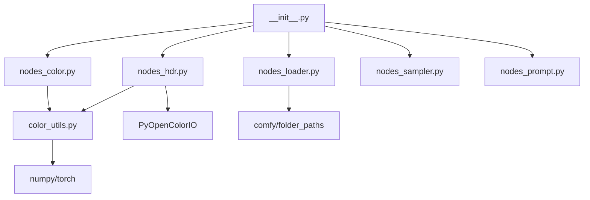

# Radiance Architecture

## Module Dependency Graph



## Core Design Principles

### 1. Separation of Concerns

| Layer | Modules | Dependencies |
|-------|---------|--------------|
| **Pure Math** | `color_utils.py` | numpy, torch |
| **UI Nodes** | `nodes_*.py` | color_utils, comfy |
| **Registration** | `__init__.py` | All nodes |

### 2. Optional Dependencies

```python
# Pattern: Try import, set flag
try:
    import PyOpenColorIO as OCIO
    HAS_OCIO = True
except ImportError:
    HAS_OCIO = False

# Pattern: Check before use
if not HAS_OCIO:
    return (image,)  # Graceful fallback
```

### 3. Extensibility Points

**Adding new log curves:**
1. Add encode/decode to `color_utils.py`
2. Add to `CURVES` dict in node class
3. Add gamut matrix if needed

**Adding new workflow presets:**
1. Add to `PRESETS` dict in `RadianceSceneLinearWorkflow`

## Key Classes

### color_utils.py
- Pure functions, no classes
- NumPy arrays in, NumPy arrays out
- Torch versions prefixed with `tensor_`

### Node Pattern
```python
class RadianceXXX:
    # Class attributes: CURVES, GAMUTS, etc.
    
    @classmethod
    def INPUT_TYPES(cls): ...
    
    RETURN_TYPES = (...)
    FUNCTION = "method_name"
    CATEGORY = "Radiance/..."
    
    def method_name(self, ...): ...
```

## Data Flow

```
Input Image (torch.Tensor)
    ↓
tensor_to_numpy_float32()
    ↓
Pure function (np.ndarray → np.ndarray)
    ↓
numpy_to_tensor_float32()
    ↓
Output Image (torch.Tensor)
```

## Extending Radiance

### New Node Module

1. Create `nodes_yourfeature.py`
2. Add node classes following pattern
3. Add `NODE_CLASS_MAPPINGS` and `NODE_DISPLAY_NAME_MAPPINGS`
4. Import in `__init__.py`:

```python
from .nodes_yourfeature import NODE_CLASS_MAPPINGS as YF_NODES
NODE_CLASS_MAPPINGS.update(YF_NODES)
```
