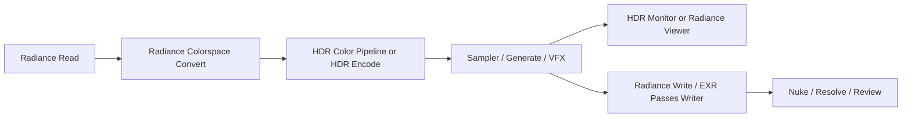

# Radiance Documentation

Radiance is a production-oriented ComfyUI node pack for HDR image handling, ACES/OCIO color management, VFX plate preparation, review, video workflows, upscaling, and DCC handoff.

This documentation is written as a repo-based wiki. It is meant for artists, technical directors, color pipeline engineers, and developers who need to build reliable Radiance workflows without reading the source code first.

## Start Here

| Page | Use it for |
| :--- | :--- |
| [Quickstart](quickstart.md) | Installing Radiance and building a first working graph. |
| [Concepts](concepts.md) | Understanding HDR, EXR, ACES/OCIO, tensors, and DCC handoff. |
| [Node Reference](nodes.md) | End-user descriptions for every registered Radiance node. |
| [Gaussian Splatting](built-in-nodes/splatting.md) | Load, render, and train 3D Gaussian Splatting scenes. |
| [Workflows](workflows.md) | Production recipes for HDR roundtrip, review, VFX, video, and DCC export. |
| [Troubleshooting](troubleshooting.md) | Fixes for common install, color, EXR, preview, and bridge issues. |
| [Developer Notes](developer.md) | Architecture, node authoring, tests, release checks, and dynamic gizmos. |
| [Coverage Ledger](coverage.md) | The node coverage checklist used to verify this documentation. |

## What Radiance Is For

| Area | Purpose |
| :--- | :--- |
| HDR and EXR | Preserve scene-linear range and highlight detail through ComfyUI workflows. |
| ACES and OCIO | Move images through known color spaces instead of relying on viewport guesses. |
| VFX | Prepare plates, masks, depth, motion, optics, multipass data, and relighting passes. |
| Review | Inspect frames with viewers, overlays, contact sheets, frame stamps, and preview servers. |
| Video | Build, sample, decode, route, and export image batches and video latents. |
| Pipeline | Save project metadata and hand media to Nuke, DaVinci Resolve, and studio folders. |

## Recommended First Graph

## Production Rules

| Rule | Why it matters |
| :--- | :--- |
| Use EXR for HDR work. | SDR formats clip or quantize values that Radiance is designed to preserve. |
| Keep color transforms explicit. | ACES, OCIO, log, display, and scene-linear spaces are not interchangeable. |
| Match paired encode/decode settings. | HDR reconstruction depends on the same assumptions being used at both ends. |
| Review with scopes and diagnostics. | A viewport transform can hide clipping, gamut issues, or compression artifacts. |
| Treat DCC bridges as local pipeline tools. | Nuke and Resolve handoff should stay predictable, local, and authenticated when tokens are used. |

## Node Coverage

The main catalog currently documents 104 registered Radiance nodes across Color, HDR, IO, VFX, Pipeline, Review, Upscale, Video, AI, and Generate groups. User-generated gizmos are dynamic and are documented as a workflow pattern rather than as fixed node names.

