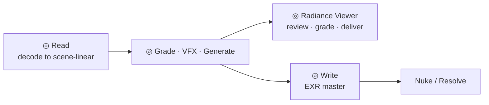

# Radiance Documentation

Radiance is a production node pack for ComfyUI built around 32-bit float and
HDR/ACES image pipelines: VFX plate preparation, colour management, review
tooling, in-canvas studio dashboards, and handoff to Nuke and DaVinci Resolve.

**Version 3.2.0 · 109 nodes.**

Written for the people who have to make a shot work — artists, technical
directors, colour pipeline engineers — and for developers extending the pack. It
assumes you know your craft and do not yet know Radiance.

---

## Start here

| Page | Read it when |
| :--- | :--- |
| [Quickstart](quickstart.md) | Installing, confirming the install, and building three working graphs. |
| [Concepts](concepts.md) | You want to know *why* Radiance insists on scene-linear, and what alpha, EXR and HDR actually mean here. |
| [Colour Management](color-management.md) | You need a specific deliverable to be right: what to set, where. |
| [Viewer and Delivery](viewer-and-delivery.md) | Reviewing, grading in the Viewer, and exporting a master. |
| [Workflows](workflows.md) | You want a recipe to copy. |
| [Node Reference](nodes.md) | You need a node's exact parameters. |
| [Known Limitations](limitations.md) | **Before you trust a label.** What does not do what its name implies. |
| [Troubleshooting](troubleshooting.md) | Something is wrong and you want the likely cause first. |
| [Glossary](glossary.md) | A term is unfamiliar. |
| [Developer Notes](developer.md) | You are writing or extending a node. |
| [Coverage Ledger](coverage.md) | You want the full node list and the current documentation gaps. |

---

## What Radiance is for

| Area | What it gives you |
| :--- | :--- |
| **HDR and EXR** | Scene-linear values survive the whole graph. Highlights above display white are preserved, not clipped. |
| **Colour management** | ACES, OCIO, eight camera log curves, eleven sets of primaries, LUTs, CDL — all explicit, none guessed. |
| **VFX** | Plate prep, masks and roto, depth, camera and lens optics, motion, multipass extraction, real AOV ingestion, relighting. |
| **Review** | A WebGL viewer with scopes and grading, a lightweight viewer, contact sheets, flipbooks, focus peaking, QC. |
| **Delivery** | Graded masters with CDL, AMF and JSON sidecars, versioning, and a session log. |
| **Video** | Loading, routing, temporal conditioning, sampling, batch decode and export. |
| **Pipeline** | In-canvas project, shot and asset management; structured handoff to Nuke and Resolve. |

---

## The five rules

Nearly every problem people hit is one of these.

| Rule | Why |
| :--- | :--- |
| **Decode once at the top, encode once at the bottom.** | A second transform in the middle is the most common cause of wrong colour. |
| **Work in scene-linear.** | Exposure only means "stops" as a multiply in a linear space. Blurs, blends and grain are only physically right there too. |
| **Use EXR for anything you keep.** | PNG and JPEG clip at 1.0 and quantise. They are proxies. |
| **Know which space every input file is in.** | Radiance will not guess, and a mislabelled input is wrong all the way down. |
| **QC before you deliver.** | A viewport transform hides clipping, out-of-gamut colour and banding. |

---

## First graph

```mermaid
flowchart LR
    A["◎ Read<br/>decode to scene-linear"] --> B["◎ Grade · VFX · Generate"]
    B --> C["◎ Radiance Viewer<br/>review · grade · deliver"]
    B --> D["◎ Write<br/>EXR master"]
    D --> E["Nuke / Resolve"]
```

Drag [`workflows/start.json`](../workflows/start.json) onto the canvas for a
ready-made version.

---

## About this documentation

The node reference is **generated from the running catalog**, not written by
hand, so it cannot drift: `tools/generate_docs.py` reads `NODE_CLASS_MAPPINGS`,
and `tests/test_docs_coverage.py` fails if the output is out of date or if a node
count quoted anywhere disagrees with the code.

That matters because it did drift, in both directions at once. Before 3.2.0 the
ledger listed 96 nodes while ComfyUI loaded 100: nine node classes existed in the
source and had never been registered, and four registered nodes had never been
added to the ledger.

The [Known Limitations](limitations.md) page exists for the same reason. Where a
control does not do what its name says, it is written down with a measurement
rather than left for you to discover.

---

## Version

| | |
| :--- | :--- |
| Release | 3.2.0 ("Audit Release"), 2026-07-29 |
| Nodes | 109 |
| Requires | ComfyUI ≥ 0.2.2, Python ≥ 3.9 |
| Licence | GPL-3.0 |
| Changelog | [CHANGELOG.md](../CHANGELOG.md) |

3.2.0 changes colour output on several paths. If you have approved masters made
with 3.1.x, re-check them before conforming new work against them — particularly
anything graded through the Viewer's delivery panel, tone-mapped with AgX, or
exported through the ACES 2.0 Cinema or HLG transforms. The
[changelog](../CHANGELOG.md) lists each one.
