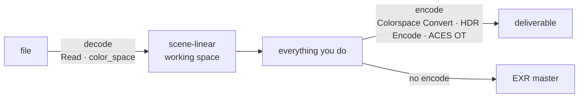

[← Back to Radiance docs](README.md)

# Colour Management

The practical guide. [Concepts](concepts.md) explains *why*; this page is *what
to set, where*.

---

## The one rule

**Decode once at the top. Work in scene-linear. Encode once at the bottom.**



Every colour bug that is not a mislabelled input is a second transform sneaking
in somewhere in the middle.

---

## Choosing a working space

| Working space | Use it when | Notes |
| :--- | :--- | :--- |
| **Linear Rec.709** | The whole shot lives in Rec.709 and always will | Simplest. Saturated colours can go out of gamut and clip. |
| **ACEScg (AP1)** | Anything with CG, HDR, or multi-source footage | Wide enough that intermediate results stay in gamut. The default choice for VFX. |
| **Linear Rec.2020** | HDR broadcast delivery | Matches the delivery gamut, so no final primaries conversion. |

If in doubt, **ACEScg**. It is what the rest of the industry uses as a rendering
and compositing space, and it is what Radiance's HDR and ACES nodes expect.

---

## Setting up Read

`color_space` on the Read node answers one question: *what curve and primaries
is this file in?* Radiance decodes from that to scene-linear.

| Your file | Set `color_space` to |
| :--- | :--- |
| EXR from a renderer | `Auto / Linear (pass-through)` — it is already linear |
| EXR from a camera or DI | whatever the DI told you; often ACEScct or LogC |
| PNG / JPEG from the web | `sRGB` |
| ProRes / MP4 delivery | `Rec.709` |
| ARRI `.ari` / LogC3 or C4 | `ARRI LogC3` or `ARRI LogC4` |
| Sony `.mxf` S-Log3 | `Sony S-Log3` |
| RED `.r3d` exported Log3G10 | `RED Log3G10` |
| Anything you are unsure about | ask, do not guess |

> `Auto / Linear (pass-through)` means **no decode at all**. It is correct for a
> linear EXR and wrong for everything else. A log file left on pass-through will
> look flat, grade badly, and quietly ruin the shot.

---

## The transforms Radiance implements

All of these round-trip (linear → encode → decode → linear) to better than
1e-5 across x ∈ [−0.02, 64], and all are monotonic across that range.

### Camera log

| Curve | 18% grey encodes to | Notes |
| :--- | :--- | :--- |
| ARRI LogC3 (EI 800) | 0.391 | The long-standing ARRI curve |
| ARRI LogC4 | 0.273 | ALEXA 35 and later; black at 0.0929 |
| Sony S-Log3 | 0.420 | Scene black at 95/1023 = 0.0929 |
| Panasonic V-Log | 0.423 | |
| Canon Log 3 | 0.343 | Includes the /0.9 reflectance scale |
| RED Log3G10 | 0.334 | Black at 0.0915 |
| DaVinci Intermediate | 0.336 | |
| ACEScct | 0.414 | ACES with a log toe, for grading |

### Display

| Curve | Notes |
| :--- | :--- |
| sRGB | The piecewise curve, not a plain 2.2 gamma |
| Rec.709 | Camera OETF; the display side is BT.1886 |
| PQ (ST.2084) | Absolute. A code value is a fixed nit level. |
| HLG (BT.2100) | Relative. Reference white at signal 0.75. |

### Primaries

Rec.709, Rec.2020, DCI-P3, Display P3, ACES AP0 (ACES2065-1), ACES AP1
(ACEScg), ARRI Wide Gamut 3 and 4, Sony S-Gamut3.Cine, DaVinci Wide Gamut, Canon
Cinema Gamut, RED Wide Gamut RGB.

Every conversion matrix maps `[1,1,1]` to `[1,1,1]` exactly — a neutral in stays
a neutral out. Bradford adaptation is applied where the white points differ (AP0
and ACEScg are D60; most delivery spaces are D65).

---

## OCIO

If your facility has an OCIO config, use it — it is the authority, and Radiance's
built-in matrices are a convenience for people who do not have one.

1. Install `opencolorio` into ComfyUI's Python environment.
2. Point Radiance at the config: set the standard `$OCIO` environment variable,
   or load one through the **OCIO Context** node.
3. The HTTP route that loads a config is restricted to the bundled ACES config,
   `$OCIO`, anything in `RADIANCE_OCIO_ROOTS`, and the ComfyUI models tree. Add
   your studio's config location to `RADIANCE_OCIO_ROOTS` (OS path separator
   between entries) if it lives elsewhere.

Radiance ships an ACES config under `ACES/config.ocio` for people starting from
nothing.

---

## Grading

Grade in scene-linear, in this order:

1. **Exposure** — a multiply. This is where you set overall level.
2. **White balance** — temperature and tint.
3. **Lift / gamma / gain** — the Resolve-style wheels, per-channel.
4. **Contrast** — pivoted, default pivot 0.18 (middle grey).
5. **Shadows / highlights** — luminance-weighted.
6. **Saturation and hue**.
7. **LUT**, if you are applying a creative look.
8. **Gamut compression**, if wide-gamut values need bringing into a smaller
   delivery gamut.

Radiance's Grade node and the Viewer's grading panel apply exactly this order,
and the Viewer's WebGL shader and the Python export path implement the same
chain — so what you see is what you export. (That guarantee was broken before
3.2.0 for six of the controls; `tests/test_delivery_contract.py` now enforces it
in both directions.)

**Grade Match** analyses a reference image and produces a grade that moves your
image toward it. Useful for shot-matching within a sequence.

**CDL** is the ASC standard — slope, offset, power, saturation — and reads and
writes `.cc` and `.cdl` files, so a look built here transfers to a grading
system and back.

---

## Delivering

### SDR (Rec.709 / sRGB)

```text
scene-linear → ACES 2.0 Output Transform (SDR) → Write (PNG/ProRes)
```

or, if you are not in an ACES pipeline:

```text
scene-linear → Colorspace Convert (Linear Rec.709 → sRGB) → Write
```

### HDR10 (PQ)

```text
scene-linear → HDR Encode (PQ, peak 1000/4000 nits) → Write (16-bit)
```

`peak_nits` here is a real property of the encode. Match it to the master you are
delivering against — 1000 for most HDR10 deliverables.

### HLG

```text
scene-linear → ACES 2.0 Output Transform (Rec.2100 HLG) → Write
```

HLG carries no absolute peak; the display supplies its own system gamma. What
matters is where diffuse white lands, which BT.2408 puts at signal 0.75.

### Digital cinema (DCP)

```text
scene-linear → ACES 2.0 Output Transform (Cinema DCI-P3) → Write (16-bit TIFF/EXR)
```

48 nits is the projector's luminance at code value 1.0, not a scale on the
scene. Radiance handles that internally; you do not need to compensate.

---

## Checking your work

**QC node** — reports clipping (both ends), out-of-gamut percentage, banding
risk and noise level. Run it before you deliver, not after.

**Policy Guard** — encodes a house standard (maximum clipping, required
colour space, bit depth) as a pass/fail so a bad master cannot leave quietly.

**Scopes in the Viewer** — waveform, vectorscope, histogram, false colour. Note
that scopes are computed on the *ungraded* texture: they show you what came in,
not what your grade did. That is deliberate but it surprises people.

---

## Things that will bite you

| Symptom | Almost always |
| :--- | :--- |
| Image looks flat and grey | A log file decoded as pass-through |
| Image looks crushed and over-contrasty | A linear file decoded as if it were log or sRGB |
| Highlights are flat above a point | Something clipped to 1.0 — check for an 8-bit round trip |
| Neutrals have a colour cast | A primaries conversion applied without white-point adaptation, or applied twice |
| Export does not match the viewer | Browser running cached JavaScript — hard-refresh ComfyUI. Check the log for a missing-key warning. |
| Matte edges darken after a blur | Premultiplied RGB blurred without unpremultiplying |
| Alpha comes back semi-transparent | An older Radiance; 3.2.0 fixed alpha in the tone-map and grade paths |

---

## Known limitations

These are real and current. See [Known Limitations](limitations.md) for the full
list.

- **The ACES 2.0 tone scale is not the Daniele Evo curve.** 18% grey renders
  about 0.84 stop above the ACES 2.0 reference on SDR; HLG diffuse white lands at
  signal 0.915 rather than 0.75. Grade against a reference you trust, not against
  the label.
- **`chromatic_adaptation` on Colorspace Convert does nothing.** The adaptation
  is baked into the precomputed matrices.
- **The EXR reader ignores the display window**, so overscan renders come back
  offset.
