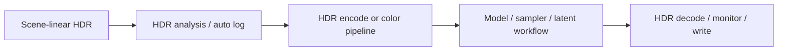

# Concepts

Radiance is easiest to use when a few production concepts are clear.

## Image Range

| Term | Meaning | Practical impact |
| :--- | :--- | :--- |
| Display-referred | Pixel values are already shaped for a display. | Good for previews and web delivery, risky for heavy grading. |
| Scene-linear | Pixel values represent scene light linearly. | Best for VFX math, EXR, relighting, and HDR recovery. |
| HDR | Values can carry highlight information above display white. | Use EXR and HDR-aware nodes to avoid clipping. |
| SDR | Usually constrained to normalized display range. | Use for review proxies or final SDR delivery. |

ComfyUI images are commonly passed as tensors. Radiance nodes try to preserve float precision where possible, but save format and viewer transforms still matter.

## EXR

EXR is the preferred container for Radiance production output. Use it when you need:

| Need | Why EXR helps |
| :--- | :--- |
| Values above `1.0` | EXR can store scene-linear HDR values. |
| Multiple passes | Multipass EXR keeps beauty, masks, depth, normals, and AOVs together. |
| Comp handoff | Nuke and Resolve workflows expect high precision image sequences. |
| Metadata | Shot and pipeline data can travel with the file. |

Use PNG/JPEG only when you want a delivery preview or lightweight contact sheet.

## ACES and OCIO

Radiance separates color operations into explicit steps:

| Operation | Typical node |
| :--- | :--- |
| Create an OCIO context | `RadianceOCIOContext` |
| Convert between spaces | `RadianceColorSpaceConvert` |
| Use ACES transforms | `RadianceACESTransform`, `RadianceACES2OutputTransformFull` |
| Apply display tone scale | `RadianceACES2Tonescale` |
| Inspect color pipeline metadata | `RadianceColorSpaceInfo`, `RadianceHDRDiagnostics` |

Do not assume a model, loader, viewer, or file format knows the correct color space automatically. Pick the source, working, and display spaces deliberately.

## HDR Encode and Recovery

Some model paths need HDR data shaped before it can safely pass through a VAE or sampler.

Keep any paired choices consistent. If a compression ratio, log curve, model hint, or metadata JSON is produced upstream, pass it downstream instead of guessing a new value.

## Masks and Alpha

Radiance uses both `MASK` tensors and image alpha/matte-style outputs. When a node produces both an `IMAGE` and a `MASK`, inspect both in the viewer before using the mask to crop, composite, or send to a model. For roto, SAM, matting, and video propagation, keep frame counts aligned.

## Video Batches

Radiance video nodes treat video as batches of frames or as video latents. End-user symptoms often come from shape mismatches, missing model metadata, or frame-count drift.

| Stage | Typical nodes |
| :--- | :--- |
| Inspect model shape | `RadianceVideoModelInfo` |
| Create latent noise | `RadianceVideoLatentNoise` |
| Build conditioning | `RadianceVideoCondMerge`, `RadianceVideoHDRConditioner` |
| Sample | `RadianceVideoSampler`, `RadianceT2VPipeline`, `RadianceI2VPipeline` |
| Decode and export | `RadianceVideoBatchDecode`, `RadianceVideoExport` |

## DCC Handoff

Radiance supports local pipeline handoff, not a cloud service. The Nuke bridge is intended for a local Nuke session. Resolve support is a folder handoff/manual import flow unless you run the optional Resolve scripting helper inside Resolve Studio.

Security defaults to local behavior. Token authentication can use `RADIANCE_DCC_AUTH_TOKEN`.

## Dynamic Gizmos

Radiance can load user-generated gizmos from `.gizmo` files. Those nodes are dynamic, so they are not listed as fixed node names in the coverage ledger. Document each studio gizmo next to the workflow it supports.

