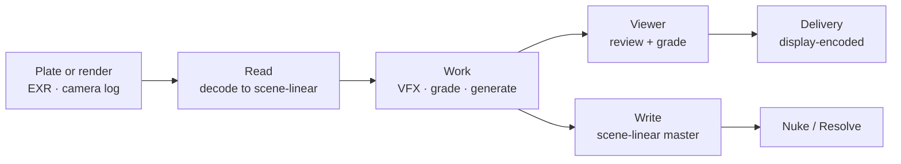

[← Back to Radiance docs](README.md)

# Core Concepts

Everything in Radiance rests on a small number of ideas about how images work.
If you already think in scene-linear and know why alpha is not a colour, skim
this and move on. If any of it is new, this page will save you more time than
any other in the documentation — almost every "Radiance made my image look
wrong" report traces back to one of these ideas.

---

## 1. Scene-linear vs display-referred

An image can hold two very different kinds of number.

**Display-referred** values describe *what a screen should emit*. They live in
0–1, they are gamma-encoded, and 1.0 means "as bright as this monitor gets". A
PNG off the internet is display-referred. So is the output of a normal Stable
Diffusion VAE decode.

**Scene-referred**, or **scene-linear**, values describe *how much light was in
the scene*. They are linear — twice the number means twice the light — and they
are unbounded. 0.18 is standard middle grey. 1.0 is roughly a white card in the
same light. The sun is somewhere north of 10,000. An EXR from a render or a
camera is scene-linear.

Why it matters, concretely:

| Operation | In scene-linear | In display-referred |
| :--- | :--- | :--- |
| Multiply by 2 | exactly one stop brighter | brighter *and* more contrasty, unpredictably |
| Blur | light spreads the way it physically does | halos are wrong around highlights |
| Blend two images | matches a real double exposure | midtones drift |
| Add grain | grain sits in the noise floor | grain crushes in the shadows |

Radiance's grading, compositing and optics nodes assume scene-linear input.
Decode to it at the top of the graph — that is what `color_space` on the Read
node is for — and encode out of it at the very end.

**How to tell which you have.** Look at the maximum value. If nothing exceeds
1.0 it is almost certainly display-referred, or a scene-linear image that has
already been clipped, which is worse. If highlights run to 4, 40 or 4000, it is
scene-linear.

---

## 2. Transfer functions and primaries are two separate things

A "colour space" is really two independent choices:

- **Transfer function** (also: gamma, EOTF, OETF, log curve) — how a number maps
  to a light level. sRGB, Rec.709, PQ, HLG, ARRI LogC4, Sony S-Log3 and plain
  linear are all transfer functions.
- **Primaries** (also: gamut) — which physical colours R, G and B actually are.
  Rec.709, P3, Rec.2020, ACES AP0 and AP1 are all sets of primaries.

They combine freely. "Linear Rec.709" and "sRGB" share primaries and differ in
transfer. "ACEScg" and "ACEScct" share primaries (AP1) and differ in transfer.

Radiance's **Colorspace Convert** changes both, correctly, in one step. What it
will *not* do is guess. Tell it the input is sRGB when the file is actually
LogC4 and it will do exactly what you asked, and the result will be wrong.

> **Practical rule.** Write down the space of every file entering your graph
> before you build the graph. Half of all colour bugs are a mislabelled input.

---

## 3. Alpha is not a colour

An alpha channel stores *coverage* — how much of the pixel the object occupies.
It is not light, so it must not be gamma-encoded, tone-mapped, exposed, graded or
colour-converted. Radiance splits alpha off before those operations and
reattaches it untouched. (Before 3.2.0 several nodes did not, and a 50% matte
came back at 0.607 or 0.214 depending on the path.)

There is a second question that catches people out: **premultiplied or
straight?**

- **Premultiplied** (associated) — RGB has already been multiplied by alpha. A
  50%-covered red pixel stores `(0.5, 0, 0, 0.5)`. This is what EXR
  conventionally holds and what compositing expects.
- **Straight** (unassociated) — RGB holds the full colour regardless of
  coverage. The same pixel stores `(1, 0, 0, 0.5)`.

Blurring, resizing or colour-correcting premultiplied RGB without unpremultiplying
first darkens edges. Radiance's compositing nodes unpremultiply, operate, then
re-premultiply. ComfyUI's `MASK` type is straight by convention, so routing a
`MASK` into a Write node's EXR alpha mixes conventions — usually fine for a matte
you will re-key, worth knowing for edges you care about.

---

## 4. What a tensor looks like here

ComfyUI passes images between nodes as PyTorch tensors, and Radiance follows the
same shapes:

| Type | Shape | Range | Notes |
| :--- | :--- | :--- | :--- |
| `IMAGE` | `(B, H, W, C)` | float32, unbounded in scene-linear | C is 3 or 4. Channels **last**. |
| `MASK` | `(B, H, W)` | float32, normally 0–1 | No channel axis. |
| `LATENT` | dict with `samples`: `(B, C, H/8, W/8)` | float32 | Channels **first**. |

Two consequences worth internalising:

- **A batch is the whole clip in memory at once.** 240 frames of 4K RGBA float32
  is about 31 GB. Use `max_video_frames` and `proxy_scale` on Read while you are
  designing the graph, then remove the limits for the final run.
- **The same tensor object reaches every consumer of a link.** A node that writes
  to its input in place corrupts every other branch. Radiance nodes clone first,
  and `tests/test_node_functional.py` verifies that for all 109 of them.

---

## 5. HDR is three different problems

"HDR" gets used for three things that need different handling.

**Dynamic range** — how many stops separate your darkest and brightest values.
A property of your data. EXR and float32 preserve it; PNG and 8-bit do not.

**Display encoding** — how you package that range for a screen. PQ (ST.2084) is
*absolute*: a code value means a fixed number of nits. HLG is *relative*: the
same file reads correctly on a 600-nit and a 2000-nit display because the display
applies its own system gamma. These are not interchangeable, and Radiance treats
them differently because the standards do.

**Tone mapping** — how you *reduce* range to fit a display that cannot show it
all. Creative, and one-way: once tone-mapped you have discarded highlight
information. Always keep the scene-linear master.

The common mistake is doing all three at once and then wondering why the
deliverable does not match the viewer. Keep them separate and explicit.

---

## 6. Log curves

Camera manufacturers store scene-linear light through a log curve so a 10- or
12-bit file can carry 14+ stops. Radiance implements ARRI LogC3 and LogC4, Sony
S-Log3, Panasonic V-Log, Canon Log 3, RED Log3G10, DaVinci Intermediate, ACEScct
and the standard display curves.

Two things to know:

- **A log image is not a look.** It is a container. It should look flat and
  washed out. Decode it to scene-linear before judging it.
- **Round-tripping is lossless in float.** Radiance's encode/decode pairs
  round-trip to better than 1e-5 across the full range, so moving through a log
  space to talk to another tool costs you nothing.

---

## 7. Where Radiance sits in a shot

```mermaid
flowchart LR
    A["Plate or render<br/>EXR · camera log"] --> B["Read<br/>decode to scene-linear"]
    B --> C["Work<br/>VFX · grade · generate"]
    C --> D["Viewer<br/>review + grade"]
    C --> E["Write<br/>scene-linear master"]
    D --> F["Delivery<br/>display-encoded"]
    E --> G["Nuke / Resolve"]
```

The master you keep is the scene-linear one. Everything to the right of the
display encode is a derived deliverable you can regenerate at any time.

---

## 8. EXR, in practice

EXR is the preferred container for anything you intend to keep.

| Setting | When to use it |
| :--- | :--- |
| 16-bit half | Default for most work. ~5.5 orders of magnitude, half the size of float. |
| 32-bit float | Depth, motion vectors, position passes, anything you will do maths on. |
| ZIP compression | Lossless, good ratio, the safe default. |
| PIZ | Lossless, better on grainy footage. |
| DWAA / DWAB | Lossy. Fine for review, not for a master. |

Multi-part EXR lets you carry several AOVs in one file; Radiance's EXR
Multi-Part writer and Multipass AOV Reader are the two ends of that.

---

## Next

- [Colour Management](color-management.md) — the practical guide to getting the
  transforms right.
- [Viewer and Delivery](viewer-and-delivery.md) — reviewing and exporting.
- [Workflows](workflows.md) — recipes that put the ideas together.
- [Glossary](glossary.md) — the vocabulary, defined.
- [Known Limitations](limitations.md) — what does not work as its label implies.
