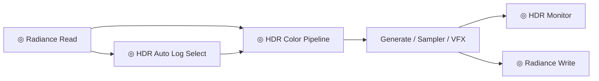
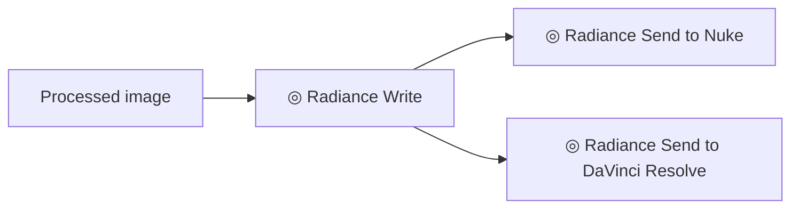

# Quickstart

This page gets Radiance installed and shows the safest first graphs for end users.

## Install

Install Radiance inside the same Python environment used by ComfyUI.

```bash
cd ComfyUI/custom_nodes
git clone https://github.com/fxtdstudios/radiance.git
cd radiance
pip install -r requirements.txt
```

Platform-specific requirement files are available:

| Platform | File |
| :--- | :--- |
| Windows | `requirements_windows.txt` |
| Apple Silicon | `requirements_mac_silicon.txt` |
| Linux | `requirements_linux.txt` |

ComfyUI normally provides `torch`; Radiance validates required dependencies at runtime.

## First Image Graph

Use this when you want a reliable image load, inspect, process, and save path.


Checklist:

| Check | Recommendation |
| :--- | :--- |
| Source format | Use EXR/TIFF when preserving high bit depth. |
| Preview | Use `◎ Radiance Viewer` or `◎ HDR Monitor` before final export. |
| Output | Use EXR for float/HDR results and PNG/JPEG only for review proxies. |

## First HDR Graph

Use this when working with high dynamic range imagery or recovering highlight detail.



Important:

| Setting | Why |
| :--- | :--- |
| Working color space | Decide before grading or model processing. |
| Compression / log choice | Keep consistent across HDR conditioning and recovery. |
| Output container | Save EXR when values above `1.0` matter. |

## First DCC Handoff

Use this when sending a processed frame or sequence to Nuke or DaVinci Resolve.



For Nuke, start the local Radiance listener in Nuke first:

```python
exec(open("/path/to/ComfyUI/custom_nodes/radiance/scripts/start_nuke_server.py").read())
```

For Resolve, Radiance exports a folder handoff that can be imported into the Resolve media pool.

## Where Nodes Appear

Radiance nodes are grouped under:

```text
FXTD STUDIOS/Radiance
```

The node display names normally start with `◎` so they are easy to search in ComfyUI.

