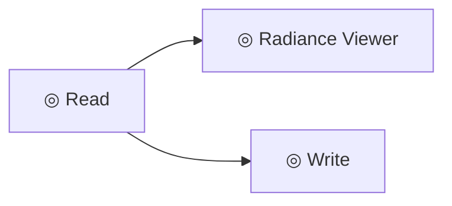
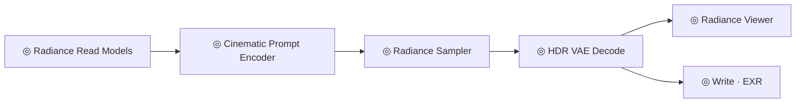

[← Back to Radiance docs](README.md)

# Quickstart

Install Radiance, confirm it loaded, and build three graphs that each do
something useful. Twenty minutes end to end.

---

## 1. Install

Install into **the same Python environment ComfyUI uses**. Radiance relies on
ComfyUI's existing PyTorch and does not install its own.

### ComfyUI Manager

Search for **Radiance** and install. Restart ComfyUI.

### Manual

```bash
cd ComfyUI/custom_nodes
git clone https://github.com/fxtdstudios/radiance.git
cd radiance
```

Then the requirements file for your platform:

```bash
pip install -r requirements_windows.txt      # Windows
pip install -r requirements_linux.txt        # Ubuntu / Linux
pip install -r requirements_mac_silicon.txt  # macOS Apple Silicon
```

On Ubuntu, OpenCV also wants a few system libraries:

```bash
sudo apt-get install -y libgl1 libglib2.0-0
```

### What each dependency unlocks

| Package | Without it |
| :--- | :--- |
| `OpenEXR` | No EXR read or write — the core of the pack |
| `OpenImageIO` | No DPX |
| `opencolorio` | No OCIO transforms; the built-in matrices still work |
| `imageio-ffmpeg` | Video export needs ffmpeg on PATH instead |
| `transformers` | No Depth Anything V2 |
| `defusedxml` | CDL XML parsing falls back to the standard parser |

---

## 2. Confirm it loaded

Start ComfyUI and look for this in the console:

```
Radiance: successfully loaded 109 nodes (v3.2.0)
```

If instead you see an **ERROR** naming modules that failed to import, read it —
it tells you which dependency is missing and which nodes are therefore absent.
A short count means missing nodes, not a cosmetic issue:

```
Radiance: loaded 59 of at least 109 expected nodes (v3.2.0) - 50 missing (46% of
the catalog). This is a failed start, not a small one: check the import errors
above, then re-run with RADIANCE_LOG_LEVEL=DEBUG for tracebacks.
```

Radiance nodes live under **FXTD STUDIOS/Radiance** in the node menu, or type
`radiance` in the search.

---

## 3. Get the models (optional)

The HDR VAE decoders use trained **RUDRA** weights from
[fxtdstudios/RUDRA](https://huggingface.co/fxtdstudios/RUDRA). Put the
`.safetensors` files in `ComfyUI/models/radiance/` — create the folder if it does
not exist — and keep the original filenames.

```bash
pip install -U "huggingface_hub[cli]"
huggingface-cli download fxtdstudios/RUDRA --local-dir "ComfyUI/models/radiance"
```

Download only the decoders for the base models you use. Without them, HDR VAE
decode falls back to the standard VAE and the output is display-referred rather
than scene-linear.

Upscale models download on first use into your ComfyUI models directory.

---

## 4. Your first graph — read, look, write

The shortest useful graph. It proves your install handles EXR and colour
correctly.


```mermaid
flowchart LR
    A["◎ Read"] --> B["◎ Radiance Viewer"]
    A --> C["◎ Write"]
```

1. Add **◎ Read**. Point `browse` at an image, or put a path in `path`.
2. Set **`color_space`** to match the file. For a render EXR leave it on
   `Auto / Linear (pass-through)`. For a JPEG or PNG choose `sRGB`. This is the
   single most important setting in the graph — see
   [Colour Management](color-management.md).
3. Add **◎ Radiance Viewer** and connect the image.
4. Add **◎ Write**, connect the image, set `output_path` and `filename`, choose
   `IMG │ EXR (16-bit half)`.
5. Queue.

You should see the image in the Viewer and find the EXR on disk. If the picture
looks flat and grey, your `color_space` is wrong.

---

## 5. Second graph — generate in HDR


```mermaid
flowchart LR
    A["◎ Radiance Read Models"] --> B["◎ Cinematic Prompt Encoder"]
    B --> C["◎ Radiance Sampler"]
    C --> D["◎ HDR VAE Decode"]
    D --> E["◎ Radiance Viewer"]
    D --> F["◎ Write · EXR"]
```

The Sampler hides widgets that do not apply to the detected model, so it will
look different for Flux than for SDXL. On Flux, leave `cfg` at 1.0.

**HDR VAE Decode** with a RUDRA decoder gives you a scene-linear result with
highlight information above 1.0 — that is what makes the EXR worth keeping.

Drag [`workflows/start.json`](../workflows/start.json) onto the canvas for a
ready-made version of this.

---

## 6. Third graph — grade and deliver


```mermaid
flowchart LR
    A["◎ Read"] --> B["◎ Grade"]
    B --> C["◎ Radiance Viewer"]
    C -->|"RENDER"| D["master + sidecars"]
```

1. Read a plate as scene-linear.
2. Grade it — exposure first, then the rest.
3. Open the Viewer, refine the grade in its panel, set the delivery format and
   path, press **RENDER**.

What you grade in the Viewer is what gets written, along with a CDL, an AMF, a
JSON metadata file and a thumbnail. See
[Viewer and Delivery](viewer-and-delivery.md).

---

## 7. Where to go next

| If you want to | Read |
| :--- | :--- |
| Understand scene-linear, alpha, HDR | [Concepts](concepts.md) |
| Get colour right for a specific deliverable | [Colour Management](color-management.md) |
| Review and export properly | [Viewer and Delivery](viewer-and-delivery.md) |
| Copy a production recipe | [Workflows](workflows.md) |
| Look up a node's parameters | [Node Reference](nodes.md) |
| Know what does not work as labelled | [Known Limitations](limitations.md) |
| Fix something | [Troubleshooting](troubleshooting.md) |

---

## Quick sanity checklist

- [ ] Console says `successfully loaded 109 nodes`, no ERROR
- [ ] `color_space` on Read matches the actual file
- [ ] Working in scene-linear, encoding once at the end
- [ ] Masters written as EXR, proxies as PNG/MP4
- [ ] QC node run before delivering
- [ ] Read [Known Limitations](limitations.md) before trusting the ACES label
