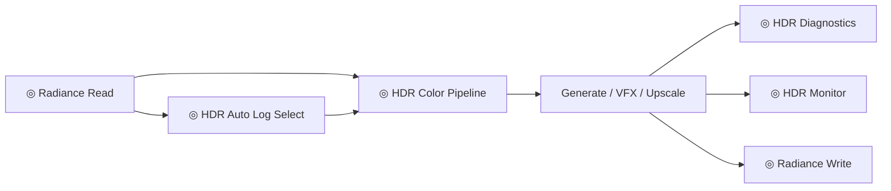
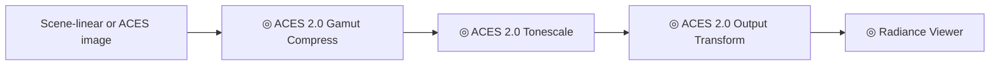
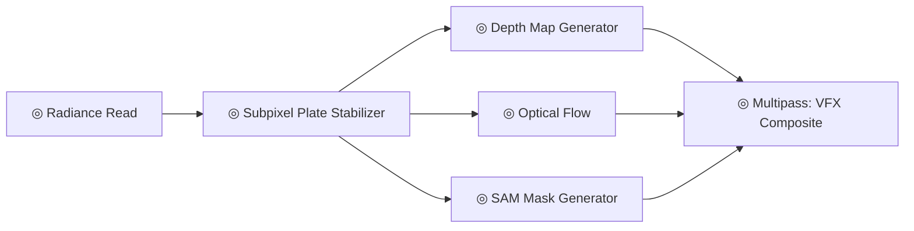
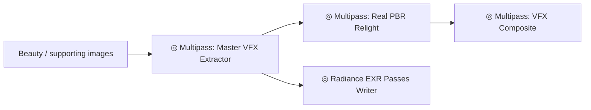
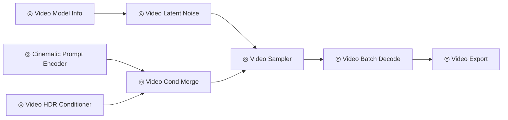
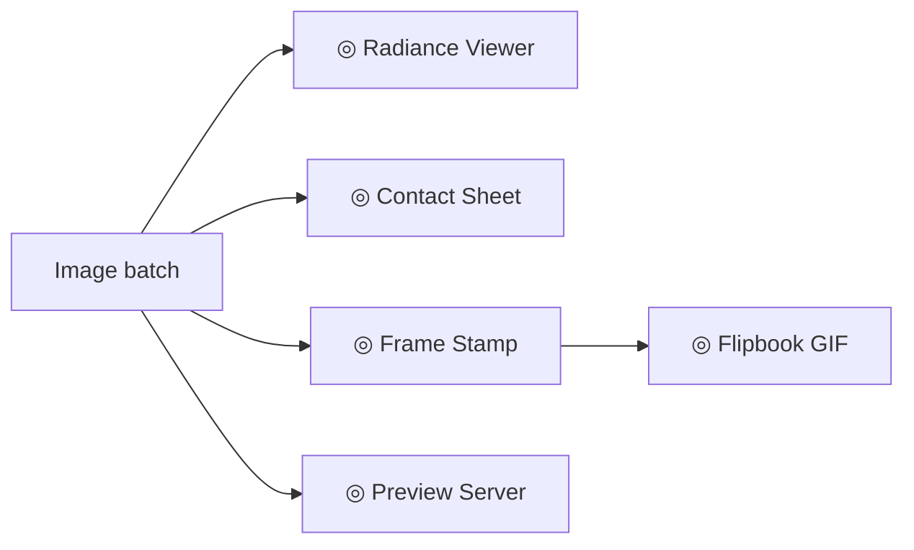
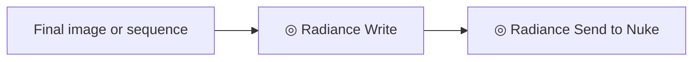
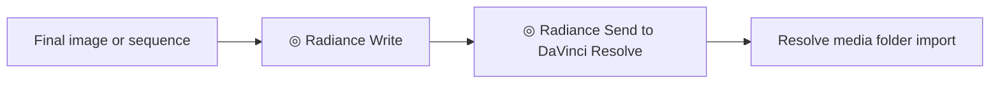

# Workflows

These recipes are written for end users who want a working graph pattern first, then tuning.

## HDR EXR Roundtrip

Use this for source plates or generated images where highlights must survive processing.



Recommended settings:

| Stage | Recommendation |
| :--- | :--- |
| Read | Prefer EXR for scene-linear plates. |
| Analyze | Use auto log or diagnostics before committing to a delivery transform. |
| Process | Keep the same metadata or compression assumptions across the graph. |
| Review | Inspect both image and report outputs. |
| Write | Use EXR for master output and PNG/JPEG only for review. |

## ACES Review Transform

Use this when you need a controlled display rendering from an ACES-managed image.



This is a viewing/delivery path. Keep a scene-linear master if you still need to composite or relight.

## VFX Plate Prep

Use this when preparing a shot for masks, depth, motion, or comp.



Tips:

| Task | Useful nodes |
| :--- | :--- |
| Stabilize a plate | `RadianceSubpixelStabilizer` |
| Generate depth | `RadianceDepthMapGenerator` |
| Estimate motion | `RadianceOpticalFlow`, `RadianceMotionBlur` |
| Build masks | `RadianceSAMModelLoader`, `RadianceSAMGenerator`, `RadianceLinearMatting` |
| Composite | `RadianceBlendComposite`, `RadianceMultipassComposite` |

## Multipass Relight

Use this when you have or want AOV-like data for relighting and comp.



Use EXR output for passes. Keep pass names stable if another DCC reads them.

## Video Generation

Use this for text-to-video or image-to-video workflows.



If you want a single high-level node, start with `RadianceT2VPipeline` or `RadianceI2VPipeline`.

## Review and Approval

Use this when the goal is review, not final delivery.



Use contact sheets and GIFs for fast approval. Use EXR or source sequences for final comp review.

## Nuke Handoff



Start the Nuke listener inside Nuke:

```python
exec(open("/path/to/ComfyUI/custom_nodes/radiance/scripts/start_nuke_server.py").read())
```

Use token auth with `RADIANCE_DCC_AUTH_TOKEN` when a studio policy requires it.

## Resolve Handoff



Resolve support is a folder handoff by default. Live Resolve scripting requires the helper to run inside Resolve Studio.

